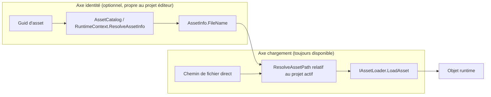

# Rapport d'analyse — Chargement d'assets dans les démos (`AssetContentManager.LoadDirectly`)

## Résumé exécutif

`LoadDirectly<T>` n'est pas un simple reliquat isolé : c'est le symptôme visible d'un problème plus large. **Il existe aujourd'hui quatre façons différentes de charger un asset dans `CasaEngine.Demos`**, avec des garanties et des chemins de résolution différents, et aucune n'est documentée comme étant "la bonne façon de charger un fichier libre dans une démo". `LoadDirectly` est la moins mauvaise de ces méthodes ad hoc (elle passe au moins par le registre `IAssetLoader`), mais elle est marquée `[Obsolete("Used only for neoforce controls")]` — un commentaire aujourd'hui **faux**, puisqu'elle est utilisée par des démos d'animation modernes qui n'ont aucun rapport avec Neoforce.

Le vrai problème architectural n'est donc pas "`LoadDirectly` est obsolète, il faut la supprimer" mais : **le moteur n'a pas de mécanisme de premier ordre, non lié au catalogue d'un projet éditeur, pour charger un fichier connu par son chemin**. Le besoin exprimé (charger n'importe quel asset dans une démo, sans dépendre de la structure "projet éditeur", mais de façon cohérente) est légitime et partiellement déjà couvert par le code existant — il manque une consolidation, pas une réécriture.

Points clés :
- `Load<T>(Guid)` (catalogue/projet) et `LoadDirectly<T>(path)` (fichier libre) partagent déjà la même résolution de chemin projet et le même registre `IAssetLoader` — l'architecture de base est saine.
- Mais 2 démos bypassent également `AssetContentManager` entièrement via `Texture2D.FromFile` brut, et une démo instancie un `IAssetLoader` concret à la main — donc 4 mécanismes cohabitent au lieu de 2.
- Le contenu de `CasaEngine.Demos/Content` a déjà la forme d'un projet éditeur (`AssetInfos.json` + `DemosGame.json` + `DefaultWorld.world`), mais `DemosGame.cs` ne s'appuie pas sur `ProjectSettingsHelper.Load(...)` et duplique manuellement une partie de cette logique — avec une divergence de `ProjectPath` à la clé.
- Convention de chemin incohérente entre call sites `LoadDirectly` (certains préfixent `Content\`, d'autres non) → risque concret de chemin invalide sur au moins 2 call sites.
- Un objet chargé via `LoadDirectly` n'a jamais d'`AssetId`/`Name`/`FileName` renseigné (contrairement à `Load<T>`), ce qui crée une asymétrie d'état selon le chemin de chargement.

Ce rapport propose un modèle cible qui garde deux axes indépendants (résolution d'identité via catalogue optionnelle, chargement par chemin toujours disponible) plutôt qu'une fusion des deux, afin de rester compatible avec l'existant et de respecter les règles de compatibilité API du dépôt.

---

## 1. Ce qui existe aujourd'hui dans `AssetContentManager`

Le moteur propose déjà deux entrées de chargement bien distinctes dans [AssetContentManager.cs](CasaEngine/Framework/Assets/AssetContentManager.cs) :

| Méthode | Entrée | Résolution de chemin | Cache / identité | Statut |
|---|---|---|---|---|
| `Load<T>(Guid id, categoryName, cache)` ([AssetContentManager.cs](CasaEngine/Framework/Assets/AssetContentManager.cs#L79)) | Un `Guid` d'asset | `ResolveAssetInfo(id)` → `AssetCatalog`/`RuntimeContext.ResolveAssetInfo` → `AssetInfo.FileName` → `ResolveAssetPath` | Mis en cache par id+nom ; stamp `AssetId`/`Name`/`FileName` sur les `ObjectBase` ([ligne 107-112](CasaEngine/Framework/Assets/AssetContentManager.cs#L107-L112)) | API normale, "projet éditeur" |
| `LoadDirectly<T>(string assetFileName)` ([AssetContentManager.cs](CasaEngine/Framework/Assets/AssetContentManager.cs#L130)) | Un chemin de fichier relatif | `ResolveAssetPath(assetFileName)` — **la même méthode que `Load<T>`** | Aucun cache, aucun stamp d'identité | `[Obsolete("Used only for neoforce controls")]` |

Les deux méthodes utilisent le **même** registre de décodage (`IAssetLoader` via `_assetLoaderByType`, peuplé par [AssetLoaderRegistry.RegisterLoaders](CasaEngine/Framework/Assets/AssetLoaderRegistry.cs#L23)) et la **même** résolution de chemin projet ([`ResolveAssetPath`](CasaEngine/Framework/Assets/AssetContentManager.cs#L155-L163)) :

```csharp
private string ResolveAssetPath(string relativeFileName)
{
    if (RuntimeContext != null)
    {
        return RuntimeContext.GetAssetPath(relativeFileName);
    }
    return Path.Combine(EngineEnvironment.ResolveProjectPath(EngineEnvironment.ProjectPath), relativeFileName);
}
```

**Conclusion intermédiaire :** `LoadDirectly` n'est donc *pas* un mode "hors projet" — c'est un mode "hors catalogue, mais toujours relatif à la racine du projet actif (`RuntimeContext.ProjectPath`)". C'est une distinction importante : l'architecture actuelle sépare déjà correctement "décodage de fichier" (`IAssetLoader`, neutre) de "résolution d'identité" (`AssetCatalog`, propre au projet éditeur). Le vrai manque est que ce mode "hors catalogue" n'est pas un citoyen de première classe : il est catalogué comme obsolète/legacy alors qu'il est structurellement correct pour l'usage des démos.

---

## 2. Inventaire des mécanismes de chargement réellement utilisés dans `CasaEngine.Demos`

En pratique, le code des démos utilise **quatre** mécanismes différents, pas deux :

| # | Mécanisme | Exemple(s) | Passe par `AssetContentManager` ? | Cache | Stamp identité |
|---|---|---|---|---|---|
| A | `AssetCatalog.GetByFileName(path).Id` puis `Load<T>(id)` | [CutsceneMoveToDemo.cs L46-48](CasaEngine.Demos/Demos/CutsceneMoveToDemo.cs#L46-L48), [TileMapDemo.cs L26-27](CasaEngine.Demos/Demos/TileMapDemo.cs#L26-L27) | Oui | Oui (sauf `cache:false` explicite) | Oui |
| B | `AssetContentManager.LoadDirectly<T>(path)` | [AnimationBlendDemo.cs L287](CasaEngine.Demos/Demos/AnimationBlendDemo.cs#L287), [AnimationIkDemo.cs L69](CasaEngine.Demos/Demos/AnimationIkDemo.cs#L69), [SkinnedMeshDemo.cs L88](CasaEngine.Demos/Demos/SkinnedMeshDemo.cs#L88), [SoldierLocomotionModelFactory.cs L33](CasaEngine.Demos/Demos/SoldierLocomotionModelFactory.cs#L33) | Oui | Non | Non |
| C | `Texture2D.FromFile(GraphicsDevice, path)` brut | [Collision2dBasicDemo.cs L38](CasaEngine.Demos/Demos/Collision2dBasicDemo.cs#L38), [Collision3dBasicDemo.cs L41,L61](CasaEngine.Demos/Demos/Collision3dBasicDemo.cs#L41), [SceneManagementDemo.cs L29](CasaEngine.Demos/Demos/SceneManagementDemo.cs#L29), [StaticModelDemo.cs L114](CasaEngine.Demos/Demos/StaticModelDemo.cs#L114) | **Non** | Non | N/A |
| D | Instanciation directe d'un `IAssetLoader` concret | `new GltfRiggedModelReader().LoadAsset(...)` dans [AnimationBlendDemo.cs (CreateRiggedModel)](CasaEngine.Demos/Demos/AnimationBlendDemo.cs#L287-L291) | **Non** | Non | Non |

Le mécanisme D est particulièrement révélateur : dans la **même méthode** (`CreateRiggedModel`), le modèle "idle" est chargé via `LoadDirectly` (mécanisme B) alors que les modèles "walk" et "run" sont chargés en instanciant directement `GltfRiggedModelReader` avec un chemin absolu construit à la main (mécanisme D) — deux façons différentes de charger le même type de fichier (`.glb`), à quelques lignes d'écart, sans raison apparente autre que l'historique.

---

## 3. Problèmes identifiés

### F1 — Quatre mécanismes de chargement cohabitent sans règle documentée
**Sévérité : Élevée.**
Un nouveau contributeur ne peut pas savoir lequel utiliser. Les mécanismes C et D bypassent complètement `AssetContentManager`, ce qui les prive de tout ce que l'abstraction est censée apporter (voir F5/F6 ci-dessous).

### F2 — Divergence possible entre `EngineEnvironment.ProjectPath` et `RuntimeContext.ProjectPath`
**Sévérité : Élevée.**
`CasaEngineGame` capture `RuntimeContext` dans son constructeur ([CasaEngineGame.cs L116](CasaEngine/Framework/Application/CasaEngineGame.cs#L116)), via `GameSettings.CreateRuntimeContext()` → `EngineRuntimeContext.FromGlobals()`, qui lit `EngineEnvironment.ProjectPath` **au moment de la construction**. Or `DemosGame.Initialize()` réassigne `EngineEnvironment.ProjectPath` *après coup* ([DemosGame.cs L52](CasaEngine.Demos/DemosGame.cs#L52)) :

```csharp
EngineEnvironment.ProjectPath = Path.Combine(Environment.CurrentDirectory, "Content");
```

Cette réassignation n'a aucun effet sur `RuntimeContext.ProjectPath`, qui reste figé à la valeur capturée à la construction (`Environment.CurrentDirectory` au moment du `new DemosGame()`). Comme `AssetContentManager.ResolveAssetPath` utilise `RuntimeContext.GetAssetPath(...)` dès que `RuntimeContext != null` (ce qui est toujours vrai en pratique, cf. [CasaEngineGame.cs L124](CasaEngine/Framework/Application/CasaEngineGame.cs#L124)), **la ligne 52 de `DemosGame.cs` n'a en réalité aucun effet observable sur la résolution des chemins d'assets**. Le fait que les démos fonctionnent malgré tout tient au hasard : `Environment.CurrentDirectory` pointe déjà vers le dossier contenant `Content/` quand on lance les démos depuis le dossier du projet.
C'est un état global dupliqué et non synchronisé — une source classique de bug silencieux dépendant de l'ordre d'exécution.

### F3 — Convention de chemin incohérente entre call sites `LoadDirectly`
**Sévérité : Moyenne (à vérifier à l'exécution).**
Certains appels préfixent le chemin par `Content\`, d'autres non, alors que la résolution passe toujours par la même méthode :

| Fichier | Appel | Préfixe `Content\` |
|---|---|---|
| [AnimationIkDemo.cs L69](CasaEngine.Demos/Demos/AnimationIkDemo.cs#L69) | `LoadDirectly<SkinnedMesh>("Content\\SkinnedMesh\\kid_idle.model")` | Oui |
| [SkinnedMeshDemo.cs L88](CasaEngine.Demos/Demos/SkinnedMeshDemo.cs#L88) | `LoadDirectly<SkinnedMesh>("Content\\SkinnedMesh\\kid_idle.model")` | Oui |
| [AnimationBlendDemo.cs L287](CasaEngine.Demos/Demos/AnimationBlendDemo.cs#L287) | `LoadDirectly<RiggedModel>(@"SkinnedMesh\kid_idle.glb")` | **Non** |
| [SoldierLocomotionModelFactory.cs L33](CasaEngine.Demos/Demos/SoldierLocomotionModelFactory.cs#L33) | `LoadDirectly<RiggedModel>(@"SkinnedMesh\Soldier.glb")` | **Non** |

D'après la structure réelle du dossier ([CasaEngine.Demos/Content/SkinnedMesh](CasaEngine.Demos/Content/SkinnedMesh)), les fichiers vivent sous `Content/SkinnedMesh/...`. Avec `RuntimeContext.ProjectPath == Environment.CurrentDirectory` (voir F2), les deux derniers appels résolvent vers `<CurrentDirectory>/SkinnedMesh/...` — un chemin qui semble ne pas exister, contrairement au premier groupe qui résout correctement vers `<CurrentDirectory>/Content/SkinnedMesh/...`. Ceci n'a pas été vérifié en exécutant les démos (hors périmètre de cette analyse statique), mais mérite une vérification rapide (lancer `AnimationBlendDemo` et `SkeletalAnimationBlendingDemo`).

### F4 — `LoadDirectly` ignore le catalogue même quand l'asset y est déjà déclaré
**Sévérité : Moyenne.**
`Content\AssetInfos.json` contient déjà des entrées pour `SkinnedMesh\kid_idle.glb` et `SkinnedMesh\kid_idle.model`, mais ces deux fichiers sont chargés via `LoadDirectly` plutôt que via `AssetCatalog.GetByFileName(...).Id` + `Load<T>(id)` (le pattern déjà utilisé ailleurs, ex. [CutsceneMoveToDemo.cs](CasaEngine.Demos/Demos/CutsceneMoveToDemo.cs#L46)). À l'inverse, `Soldier.glb`, `kid_walk.glb` et `kid_run.glb` ne sont *pas* dans le catalogue : ce sont de vrais fichiers "libres". Il n'existe aujourd'hui aucune règle qui dise quand cataloguer un asset de démo et quand le laisser en fichier libre — la frontière que l'utilisateur cherche à clarifier n'existe pas encore dans le code.

### F5 — `Texture2D.FromFile` bypass total de `AssetContentManager`
**Sévérité : Moyenne-Élevée.**
Dans [Collision2dBasicDemo.cs](CasaEngine.Demos/Demos/Collision2dBasicDemo.cs#L38), [Collision3dBasicDemo.cs](CasaEngine.Demos/Demos/Collision3dBasicDemo.cs#L41), [SceneManagementDemo.cs](CasaEngine.Demos/Demos/SceneManagementDemo.cs#L29) et [StaticModelDemo.cs](CasaEngine.Demos/Demos/StaticModelDemo.cs#L114), la texture `checkboard.png` est chargée via `Texture2D.FromFile` directement. Cette texture :
- n'est jamais suivie pour disposal (`Unload`/`UnloadAll` ne la voient pas) ;
- n'est jamais reconstruite dans `AssetContentManager.OnDeviceReset` ([AssetContentManager.cs L193-L203](CasaEngine/Framework/Assets/AssetContentManager.cs#L193-L203)), qui n'itère que les assets enregistrés via `AddAsset`/`Load`.
C'est cohérent avec le constat déjà posé dans [docs/example-project-analysis.md](docs/example-project-analysis.md) sur les fuites GPU des vieilles démos (`Clean()` vides). C'est objectivement le pire des quatre mécanismes du point de vue architecture, alors qu'il n'est même pas marqué `[Obsolete]` — il est donc invisible dans les warnings de build.

### F6 — Instanciation manuelle d'un `IAssetLoader` concret
**Sévérité : Faible-Moyenne.**
Dans [AnimationBlendDemo.cs](CasaEngine.Demos/Demos/AnimationBlendDemo.cs#L288-L290), `new GltfRiggedModelReader().LoadAsset(...)` avec un chemin absolu construit à la main (`Path.Combine(Environment.CurrentDirectory, "Content", "SkinnedMesh", "kid_walk.glb")`) duplique une logique déjà encapsulée par [ModelLoader](CasaEngine/Framework/Assets/Loaders/ModelLoader.cs) + `AssetContentManager`. Si le pipeline de chargement `.glb` évolue (ex. gestion d'erreurs, cache de matériaux, effet par défaut), ce call site divergera silencieusement du chemin standard.

### F7 — Asymétrie d'état entre asset catalogué et asset chargé directement
**Sévérité : Moyenne.**
`Load<T>` peuple `AssetId`/`Name`/`FileName` sur tout objet `ObjectBase` ([AssetContentManager.cs L107-L112](CasaEngine/Framework/Assets/AssetContentManager.cs#L107-L112)). `LoadDirectly` ne le fait jamais. `SkinnedMesh` est un `ObjectBase` ([SkinnedMesh.cs L8](CasaEngine/Framework/Rendering/Models/SkinnedMesh.cs#L8)) : un `SkinnedMesh` obtenu via `LoadDirectly` (ex. dans `AnimationIkDemo`/`SkinnedMeshDemo`) a donc un `AssetId` vide et un `Name`/`FileName` non renseignés, contrairement à un `SkinnedMesh` catalogué. Tout code futur qui suppose qu'un asset chargé par `AssetContentManager` a toujours une identité valide (sauvegarde, inspecteur, undo/redo éditeur) se comportera différemment selon le chemin de chargement emprunté à l'origine — un piège difficile à diagnostiquer.

### F8 — Le commentaire `[Obsolete]` est trompeur et freine la bonne décision
**Sévérité : Faible (mais cause racine du malentendu).**
`[Obsolete("Used only for neoforce controls")]` ([AssetContentManager.cs L129](CasaEngine/Framework/Assets/AssetContentManager.cs#L129)) date probablement de l'époque où seule l'UI legacy Neoforce l'utilisait. Ce n'est plus vrai : 4 démos modernes d'animation/skinning s'appuient dessus aujourd'hui, sans rapport avec l'UI. Le message actuel pousse à penser (à tort) que la méthode devrait disparaître avec Neoforce, ce qui bloque toute décision de la garder/promouvoir consciemment. C'est très probablement ce qui motive la question de l'utilisateur.

### F9 — Les démos ne réutilisent pas l'infrastructure "projet" qu'elles ont déjà
**Sévérité : Faible (opportunité, pas un bug).**
[CasaEngine.Demos/Content](CasaEngine.Demos/Content) contient déjà `AssetInfos.json`, `DefaultWorld.world` et [DemosGame.json](CasaEngine.Demos/Content/DemosGame.json), qui a exactement la forme d'un fichier de projet éditeur (`WindowTitle`, `ProjectName`, `FirstWorldLoaded`, `GameplayDllName`, …, comparer avec [Projects/EmptyProject/empty.json](Projects/EmptyProject/empty.json)). Pourtant, [DemosGame.Initialize()](CasaEngine.Demos/DemosGame.cs#L38) n'appelle pas [ProjectSettingsHelper.Load(...)](CasaEngine/Framework/Configuration/Project/ProjectSettingsHelper.cs#L10) — qui ferait tout cela d'un coup (`ProjectPath`, `WindowTitle`, `FirstWorldLoaded`, `AssetCatalog.Load(...)`) — et réimplémente une partie de cette logique à la main ([DemosGame.cs L52-L56](CasaEngine.Demos/DemosGame.cs#L52-L56), puis [L63](CasaEngine.Demos/DemosGame.cs#L63)). C'est directement lié à F2 : utiliser `ProjectSettingsHelper.Load` résoudrait la divergence de `ProjectPath` gratuitement.

---

## 4. Ce qui fonctionne déjà bien (à préserver)

- **La séparation décodage/catalogue est déjà correcte en conception.** `IAssetLoader`/`AssetLoaderRegistry` ne connaissent rien du catalogue ; ils décodent un chemin en objet runtime. C'est le bon point d'extension, il ne faut pas le casser.
- **Le pattern "catalogue par nom de fichier" existant est le bon modèle pour les assets de démo *catalogués*.** `AssetCatalog.GetByFileName(path).Id` puis `Load<T>(id, cache:false)` (utilisé dans `CutsceneMoveToDemo`, `CutsceneNavigateToDemo`, `TileMapDemo`) permet de charger un asset connu uniquement par son chemin relatif, sans jamais coder son `Guid` en dur. C'est exactement le pont dont les démos ont besoin pour les assets qui *sont* dans le catalogue.
- **`CasaEngine.Demos/Content` a déjà la structure d'un projet éditeur minimal.** L'infrastructure existe ; il manque juste de la faire consommer par `DemosGame` au lieu de la dupliquer à la main.
- **`LoadDirectly` reste, dans son principe, une bonne primitive pour les fichiers non catalogués** (elle passe par `IAssetLoader`, respecte la racine de projet). Le problème est son statut (obsolète, mal nommé, mal documenté), pas sa mécanique interne.

---

## 5. Modèle architectural recommandé

Objectif : garder deux axes indépendants, ne pas les fusionner, et donner à chacun un statut de premier ordre.



Recommandations concrètes, par priorité (aucune n'est implémentée dans ce rapport — analyse uniquement, conformément à la demande) :

1. **Clarifier le contrat de `LoadDirectly` plutôt que le supprimer.**
   - Corriger/retirer le message `[Obsolete]` trompeur, ou le remplacer par une documentation XML claire : *"Charge un asset depuis un chemin de fichier, sans passer par le catalogue du projet. Utilisé par les démos/samples pour charger des fichiers qui ne font pas partie d'un projet éditeur."*
   - Envisager un renommage (ex. `LoadFromFile<T>`) via la procédure standard de dépréciation douce (garder `LoadDirectly` en wrapper `[Obsolete]` pointant vers le nouveau nom), pour ne pas casser l'API existante (règle "API stability" d'AGENTS.md).
2. **Documenter la règle de décision "catalogue vs fichier libre" pour les démos**, par exemple dans une note courte à côté de `Demo.cs` ou dans `AGENTS.md`/les instructions samples :
   - Asset qui doit pouvoir être retrouvé/référencé ailleurs par Guid (matériaux, prefabs, mondes) → toujours le déclarer dans `AssetInfos.json` et charger via `Load<T>(Guid)`.
   - Fichier de démonstration ponctuel, sans besoin de référencement croisé → chargement direct par chemin (API issue du point 1).
   - Ne jamais appeler `Texture2D.FromFile`/instancier un `IAssetLoader` à la main dans une démo (F5/F6) — toujours passer par `AssetContentManager` pour bénéficier du dispose tracking et de `OnDeviceReset`.
3. **Unifier la résolution de `ProjectPath`** en faisant consommer `ProjectSettingsHelper.Load("Content/DemosGame.json")` par `DemosGame.Initialize()` au lieu de dupliquer manuellement `EngineEnvironment.ProjectPath`/`AssetCatalog.Load` (F2/F9). Ceci corrige la divergence `RuntimeContext.ProjectPath` vs `EngineEnvironment.ProjectPath` sans toucher à `AssetContentManager`.
4. **Uniformiser la convention de chemin** des call sites `LoadDirectly` existants (retirer ou ajouter systématiquement le préfixe `Content\`) une fois le point 3 en place, et vérifier à l'exécution `AnimationBlendDemo`/`SkeletalAnimationBlendingDemo` (F3).
5. **Optionnel/plus tard :** envisager un stamp d'identité minimal (nom de fichier au moins) pour les objets `ObjectBase` chargés via le mode "fichier libre", pour réduire l'asymétrie F7, sans obliger à un `Guid` de catalogue.

---

## 6. Risques et non-régression

- `LoadDirectly` a seulement 4 call sites connus dans tout le dépôt (recherche exhaustive effectuée) — un renommage ou un changement de contrat est un périmètre limité et maîtrisable.
- Passer `DemosGame` par `ProjectSettingsHelper.Load` change l'ordre/la source de certains réglages (`WindowTitle`, `AllowUserResizing`, `IsMouseVisible` sont actuellement codés en dur dans `DemosGame.Initialize()` et existent aussi dans `DemosGame.json` avec des valeurs différentes — ex. `IsMouseVisible: false` dans le JSON contre `true` codé en dur). Il faudra réconcilier ces valeurs avant de basculer, pour ne pas changer le comportement visible des démos.
- Aucun changement de ce rapport n'affecte le format de sérialisation des assets ni l'API publique tant que le point 1 est fait en additif (nouvelle méthode + wrapper obsolète).

---

## 7. Conclusion

`LoadDirectly` n'est pas le problème en soi — c'est un mécanisme structurellement correct (même registre `IAssetLoader`, même résolution de projet que `Load<T>`) mais mal étiqueté et sous-exploité. Le vrai problème est l'absence de règle explicite et l'existence de deux mécanismes parallèles encore plus ad hoc (`Texture2D.FromFile` brut, instanciation manuelle d'un loader) qui, eux, bypassent complètement `AssetContentManager`. La recommandation n'est donc pas de forcer tous les chargements de démo à passer par un projet éditeur complet, mais de **donner un statut officiel et documenté au chargement par chemin**, tout en supprimant les deux mécanismes qui contournent totalement l'abstraction existante.
